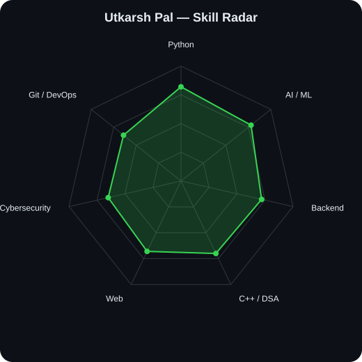
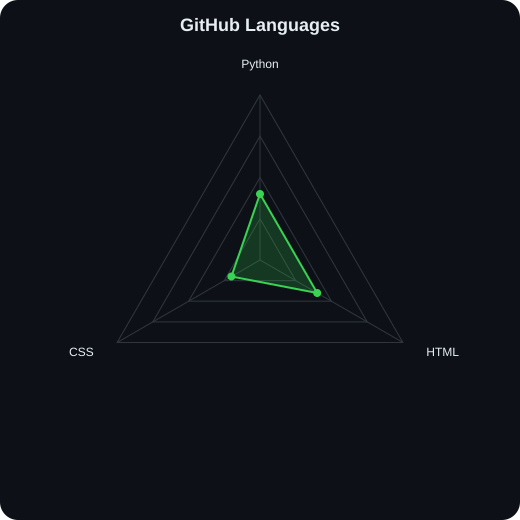
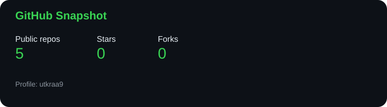

<div align="center">

# `Utkarsh Pal`

### `AI / ML` • `Full-Stack Development` • `Problem Solving`

<p>

</p>

<p><a href="https://github.com/utkraa9"></a>
</p>
</div>

---

## `~/` whoami

```console
$ cat about.txt
```

Hi, I'm **Utkarsh Pal** — a student who likes building practical software, experimenting with AI, and turning ideas into working projects.

- Currently building **AI-powered developer tools**
- Exploring **AI/ML, automation, backend development and cybersecurity**
- Learning by shipping projects instead of only following tutorials
- Interested in **open source, hackathons and real-world problem solving**

---

## `toolbox`

<p align="center"></p>

---

## `the radar`

<table><tr><td width="50%" align="center">

### Self-rated


</td><td width="50%" align="center">

### GitHub language mix


</td></tr></table>

---

## `activity`

<p align="center"></p>

---

## `projects`

<table><tr><td width="50%" valign="top">

### 🛡️ AI Guardian
Unknown-face detection and alert system using computer vision.

**Stack:** Python • OpenCV • Face Recognition

<a href="https://github.com/utkraa9/unknown-face-alert">View repository →</a>

</td><td width="50%" valign="top">

### 🐞 BugBounty AI
AI-assisted workflow for authorized security reconnaissance and evidence collection.

**Stack:** Python • FastAPI • AI • Recon

<a href="https://github.com/utkraa9/bugbounty-ai">View repository →</a>

</td></tr></table>

---

## `github stats`

<p align="center"></p>

---

## `contribution snake`

<p align="center">
  <picture>
    <source
      media="(prefers-color-scheme: dark)"
      srcset="https://raw.githubusercontent.com/utkraa9/utkraa9/output/github-contribution-grid-snake-dark.svg"
    >
    <source
      media="(prefers-color-scheme: light)"
      srcset="https://raw.githubusercontent.com/utkraa9/utkraa9/output/github-contribution-grid-snake.svg"
    >
    
  </picture>
</p>

---

## `featured`

| Project | What it does |
|---|---|
| [AI Guardian](https://github.com/utkraa9/unknown-face-alert) | Detects unknown faces and triggers alerts |
| [BugBounty AI](https://github.com/utkraa9/bugbounty-ai) | Authorized recon and security evidence workflow |
| **More projects** | Add your best repositories here |

---

<div align="center">### `keep building.`</div>
